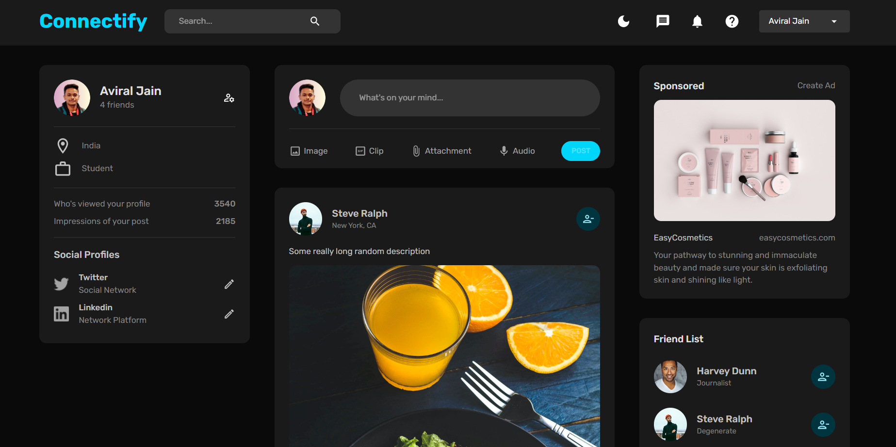

# 💭 Connectify
Connectify is a responsive Full-Stack Application using MERN Stack which allows users to connect with people. They can upload their posts, like them and can add friends to their friend list.



## ⚒ Functionalities
* Dark/Light modes.
* Authentication.
* Password encryption using bcrypt.
* Session storage with redux persist.

## 🔗 Link to the Project
To visit live version, [click here](https://connectify-aviralj02.vercel.app/)
<br />
Use the test user to see the authenticated version:
```
Email: test@test.com
Password: test
```

## 👨‍💻 Built With
[](https://www.mongodb.com/)
<br />
[](https://expressjs.com/)
<br />
[](https://react.dev/)
<br />
[](https://nodejs.org/en)
<br />
[](https://redux.js.org/)
<br />
[](https://mui.com/)

## Deployment
* Frontend deployed on [Vercel](https://vercel.com)
* Backend deployed on [Render](https://render.com/)

## Local Setup & Installation
* Clone the repo
```
$ git clone https://github.com/aviralj02/Connectify-MERN.git
```
* Install NPM Packages (use both in /client and /server)
```
$ npm install
```
* Create a .env file for server and fill up the following details
```
MONGO_URL=
JWT_SECRET=
PORT=
```
* Run Project in localhost
```
$ cd client
$ npm run start
```


